# Diseño de Mueblería con HTML y CSS

Este proyecto es una página web tipo *E-commerce* desarrollada con HTML y CSS puro. A continuación se muestran las diferentes secciones del sitio con sus respectivas capturas.

## 🏠 Inicio

Vista de la página principal con presentación del producto destacado y navegación general.

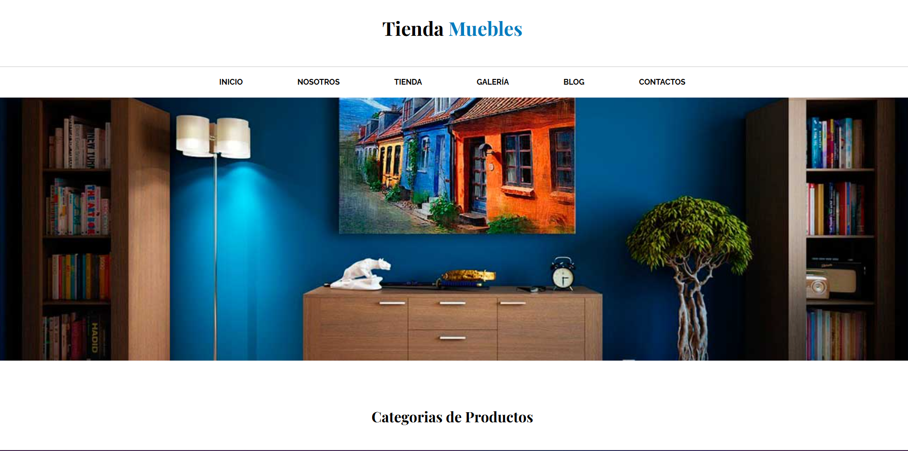
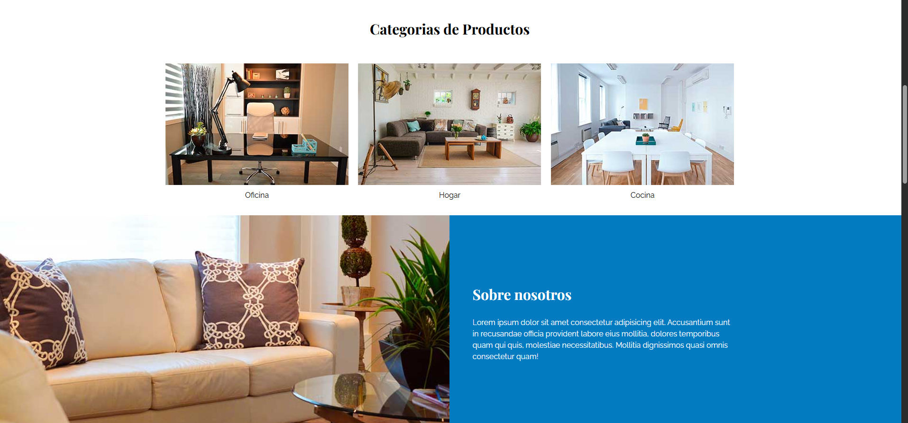

---

## 🧑‍💼 Nosotros

Sección donde se presenta la historia de la empresa, misión y visión.

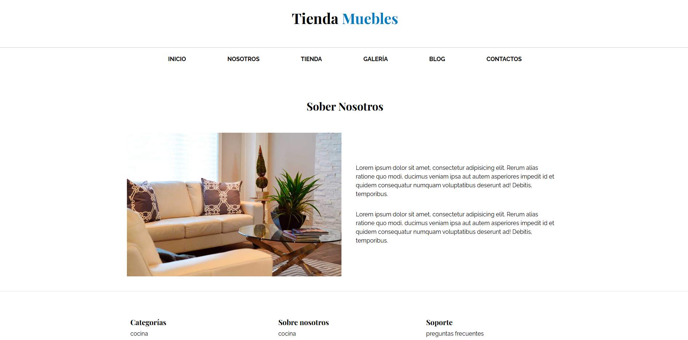

---

## 🛍️ Tienda

Catálogo de productos disponibles. Cada producto tiene su imagen, nombre, precio y botón de compra.

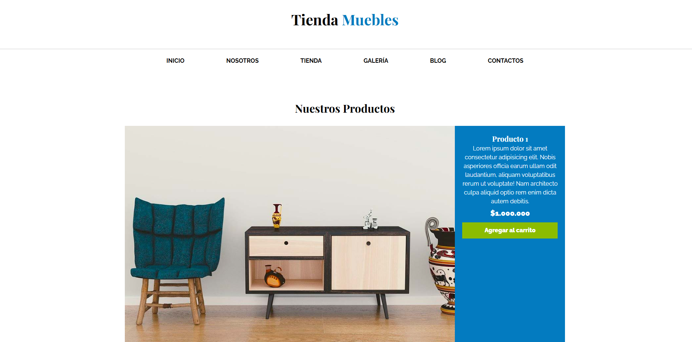
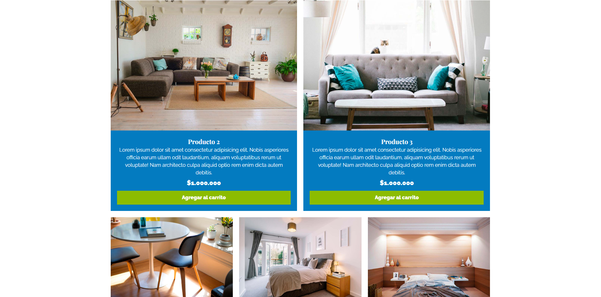
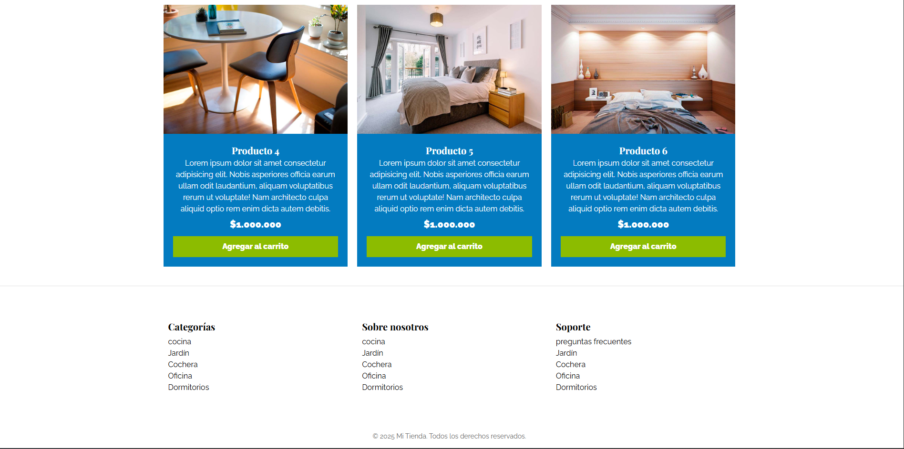

---

## 🖼️ Galería

Galería visual con imágenes destacadas de productos.

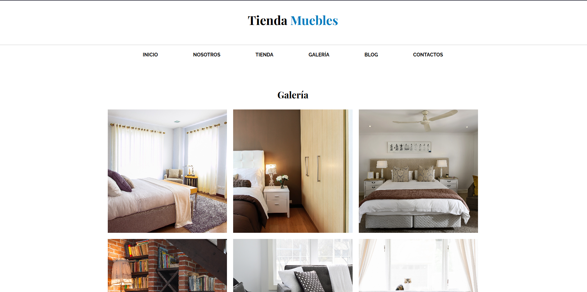
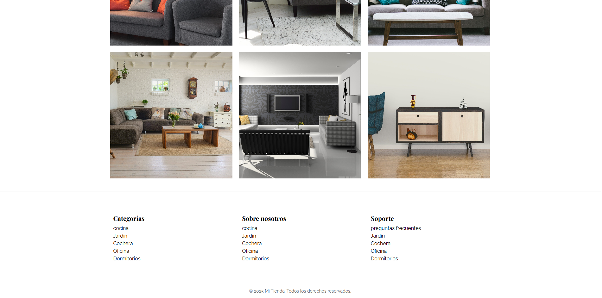

---

## 📰 Blog

Espacio con artículos y noticias relacionadas al comercio electrónico, tendencias y más.

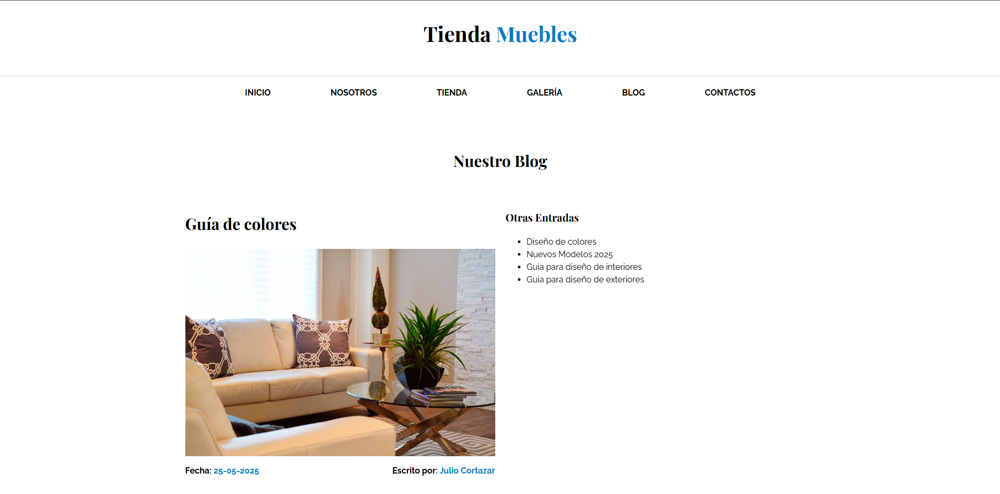
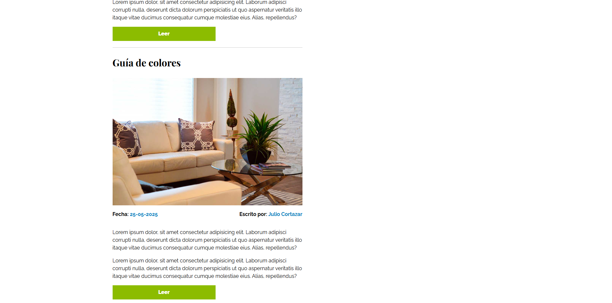

---

## 📞 Contacto

Formulario de contacto para que los clientes puedan enviar mensajes o realizar consultas.

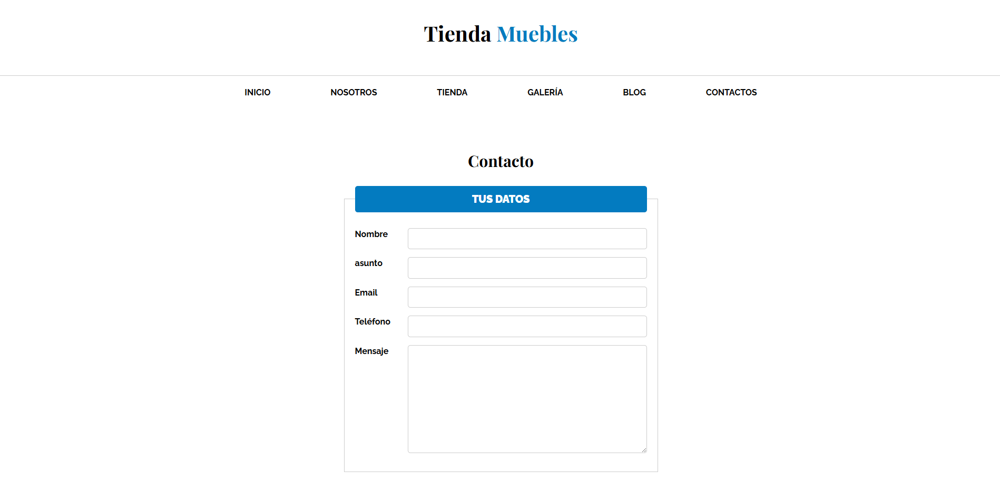
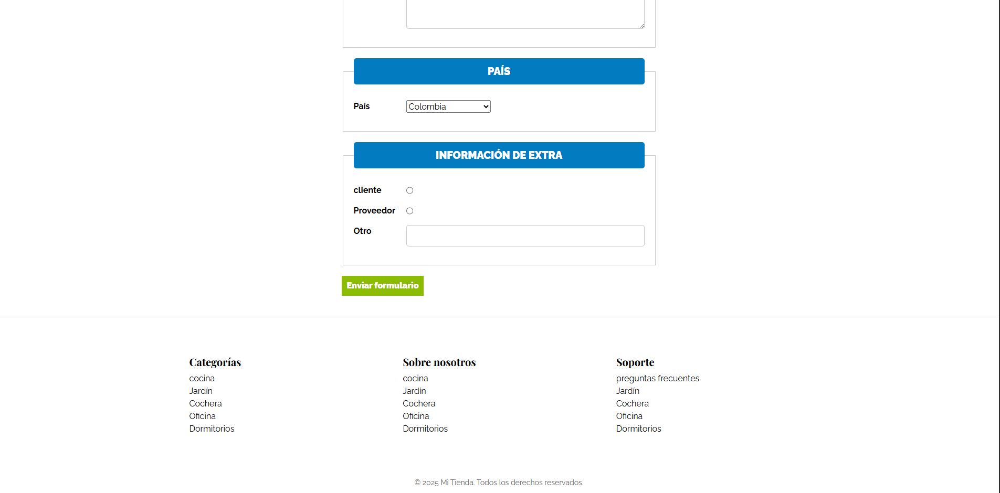

---

